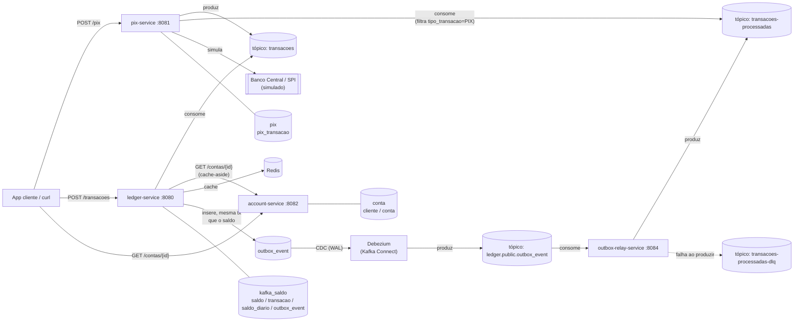
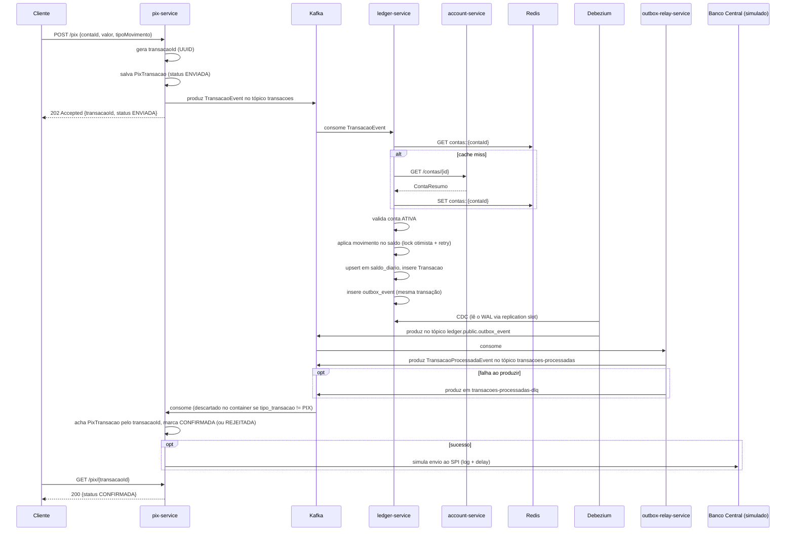

# banco-digital-kafka

Projeto de estudo de um núcleo bancário orientado a eventos: quatro microsserviços Spring
Boot, comunicação assíncrona via Kafka para o fluxo de transações e comunicação síncrona
via REST para dados cadastrais, cada serviço dono do seu próprio banco Postgres. A entrega
de eventos do `ledger-service` usa outbox transacional com CDC (Debezium), relayado pro
Kafka pelo `outbox-relay-service`.

## Sumário

- [Arquitetura](#arquitetura)
- [Serviços](#serviços)
- [Fluxo de uma transação PIX](#fluxo-de-uma-transação-pix)
- [Fluxo de uma transação DINHEIRO / TED](#fluxo-de-uma-transação-dinheiro--ted)
- [Tópicos Kafka](#tópicos-kafka)
- [Bancos de dados](#bancos-de-dados)
- [Padrões usados](#padrões-usados)
- [Como rodar](#como-rodar)
- [Referência de API](#referência-de-api)
- [Estrutura de pastas](#estrutura-de-pastas)
- [Limitações conhecidas](#limitações-conhecidas)
- [Stack](#stack)

## Arquitetura



Cada serviço tem seu próprio banco — não há join nem FK cruzando bases. `ledger-service`
guarda `conta_id` como um identificador externo simples; quem sabe o que é uma conta de
verdade é o `account-service`. O `ledger-service` nunca fala com o Kafka diretamente pra
publicar `transacoes-processadas` — ele só grava na tabela `outbox_event`, na mesma
transação que efetiva o saldo; quem publica de fato é o `outbox-relay-service`, reagindo
ao CDC que o Debezium replica do Postgres (ver [Padrões usados](#padrões-usados)).

## Serviços

| Serviço | Porta | Responsabilidade | Banco | Consome Kafka | Produz Kafka |
|---|---|---|---|---|---|
| `account-service` | 8082 | Cadastro de cliente e conta. Só REST, sem Kafka. | `conta` | — | — |
| `ledger-service` | 8080 | Core bancário: efetiva crédito/débito, controla saldo e saldo diário. Não conhece PIX nem nenhum canal específico. Não publica no Kafka diretamente — grava na outbox da própria transação. | `kafka_saldo` | `transacoes` | — (outbox, ver `outbox-relay-service`) |
| `pix-service` | 8081 | Canal PIX: recebe a movimentação, produz pro core, escuta o resultado (filtrando só PIX) e simula o envio ao Banco Central. | `pix` | `transacoes-processadas` | `transacoes` |
| `outbox-relay-service` | 8084 | Relay CDC: consome o tópico que o Debezium alimenta a partir da `outbox_event` do `ledger-service`, publica no tópico gravado no evento e manda pra `<tópico>-dlq` se não conseguir produzir. Sem banco próprio. | — | `ledger.public.outbox_event` | `transacoes-processadas` (dinâmico, o que estiver no campo `topico` do evento) |

## Fluxo de uma transação PIX



Se a conta não existir, estiver inativa, ou o saldo for insuficiente, o `ledger-service`
não persiste nada — só publica `TransacaoProcessadaEvent` com `sucesso: false` e o motivo.
O `pix-service` marca a `PixTransacao` como `REJEITADA` e **não** chama o Banco Central.

## Fluxo de uma transação DINHEIRO / TED

Mais direto — não passa pelo `pix-service`:

1. Cliente chama `POST /transacoes` direto no `ledger-service`.
2. `ledger-service` processa exatamente igual ao passo do meio do fluxo PIX acima
   (valida conta, aplica movimento, grava `saldo_diario` e `Transacao`, insere
   `outbox_event` — tudo na mesma transação).
3. O `outbox-relay-service` publica o resultado em `transacoes-processadas` assim que o
   Debezium replica o INSERT — hoje nada consome esses eventos (o `pix-service` os
   descarta no filtro), mas o tópico já existe pra qualquer consumidor futuro (extrato,
   notificação, auditoria).

## Tópicos Kafka

| Tópico | Produtor | Consumidor | Conteúdo |
|---|---|---|---|
| `transacoes` | `pix-service`, `POST /transacoes` do `ledger-service` | `ledger-service` | Pedido de movimentação (`TransacaoEvent`) |
| `transacoes-dlq` | Kafka (automático) | — | `transacoes` que falharam por erro técnico após 2 retries |
| `ledger.public.outbox_event` | Debezium (CDC da tabela `outbox_event`) | `outbox-relay-service` | Linha da outbox assim que commitada (`id`, `topico`, `chave`, `payload`) |
| `ledger.public.outbox_event-dlq` | Kafka (automático) | — | mensagens desse tópico que falharam por erro técnico (JSON inesperado, etc.) no `outbox-relay-service` |
| `transacoes-processadas` | `outbox-relay-service` (a partir da outbox do `ledger-service`) | `pix-service` (filtra PIX) | Resultado de cada tentativa, sucesso ou erro (`TransacaoProcessadaEvent`) |
| `transacoes-processadas-dlq` | Kafka (automático, erro técnico) **ou** `outbox-relay-service` (não conseguiu produzir em `transacoes-processadas`) | — | idem, pro outro tópico |

A rota pra DLQ é genérica: qualquer exceção não tratada dentro do listener (erro de
desserialização, banco fora do ar, etc.) vai automaticamente pra `"<tópico>-dlq"` depois
de 2 retries (`DefaultErrorHandler` + `DeadLetterPublishingRecoverer`, presente em todos
os serviços que consomem Kafka). Rejeição de regra de negócio (conta inválida, saldo
insuficiente) **não** é erro técnico — é tratada dentro do consumer e vira um evento
`sucesso: false` normal, nunca cai na DLQ. O `outbox-relay-service` usa essa mesma
convenção de nome (`<tópico>-dlq`) também pro caso de negócio "consegui ler o evento da
outbox mas não consegui produzir no tópico de destino" — nesse caso a DLQ é decidida
explicitamente no código, não pelo `DefaultErrorHandler` (ver
[OutboxRelayConsumer](outbox-relay-service/src/main/java/com/demo/outbox/consumer/OutboxRelayConsumer.java)).

## Bancos de dados

Um único container Postgres, três databases lógicos (cada serviço só enxerga o seu):

**`conta`** (account-service)
```
cliente (id, nome, documento, status, criado_em)
conta   (id, cliente_id → cliente, numero_conta, tipo, status, criado_em)
```

**`kafka_saldo`** (ledger-service)
```
saldo        (conta_id PK, valor, versao [lock otimista], atualizado_em)
transacao    (id, conta_id, correlation_id [idempotência], valor,
              tipo_movimento, tipo_transacao, criado_em)
saldo_diario (id, conta_id, data, valor, atualizado_em)
outbox_event (id, topico, chave, payload, criado_em)   -- ver "Padrões usados"
```

**`pix`** (pix-service)
```
pix_transacao (id, transacao_id [correlação c/ ledger-service], conta_id, valor,
                tipo_movimento, status, motivo, criado_em, atualizado_em)
```

## Padrões usados

- **Idempotência por correlation id** — `pix-service` gera um UUID (`transacaoId`) na
  entrada, que vira o `correlationId` no `ledger-service`. É o mesmo papel do
  `EndToEndId` do PIX de verdade: atravessa os dois sistemas e garante que reprocessar
  a mesma mensagem não duplica o efeito.
- **Lock otimista** — `saldo.versao` (`@Version`). Concorrência na mesma conta faz o
  commit falhar com `ObjectOptimisticLockingFailureException`, capturado por
  `@Retryable` com backoff exponencial (5 tentativas).
- **Cache-aside** — `ledger-service` cacheia `GET /contas/{id}` no Redis
  (`@Cacheable`), TTL de 10 min, serializado em JSON com *default typing* do Jackson
  (necessário pra desserializar de volta pro tipo certo em cache hit).
- **Filtro no container, não no código de negócio** — `pix-service` usa
  `RecordFilterStrategy` pra descartar tudo que não é `tipo_transacao = PIX` antes
  mesmo do `@KafkaListener` ser chamado, em vez de um `if` dentro do método.
- **Particionamento por conta** — toda publicação em `transacoes` usa `contaId` como
  chave, garantindo que as transações da mesma conta sejam processadas em ordem por um
  único consumer.
- **PK técnica vs. id de correlação** — tabelas usam `BIGINT GENERATED ALWAYS AS
  IDENTITY` como chave primária (sequencial, barato pra índice/join); UUID é usado só
  como identificador de correlação entre serviços, nunca como PK.
- **DLQ genérica por convenção de nome** — um único `DefaultErrorHandler` reaproveitado
  em cada serviço resolve o tópico de destino como `record.topic() + "-dlq"`, sem
  precisar de configuração por tópico.
- **Outbox transacional + CDC** — `SaldoService.processar()` grava o evento de
  confirmação na tabela `outbox_event`, na mesma transação que efetiva o saldo (nunca os
  dois sem o outro). O `ledger-service` nunca fala com o Kafka pra publicar esse evento;
  quem faz isso é o Debezium, lendo o WAL do Postgres via replicação lógica
  (`pgoutput`) e publicando cada INSERT no tópico `ledger.public.outbox_event`. O
  `outbox-relay-service` consome esse tópico, extrai `topico`/`chave`/`payload` e
  republica no tópico de destino real — indo pra `"<tópico>-dlq"` se não conseguir
  produzir. Isso fecha a brecha clássica do dual-write (banco e Kafka como dois passos
  separados, sem garantia conjunta) sem pagar o preço de um relay por polling: nada
  fica varrendo a tabela em loop, o Postgres empurra a mudança assim que ela é
  commitada.

## Como rodar

Pré-requisitos: Docker e Docker Compose.

```bash
docker compose up --build
```

Sobe: Postgres (com os três bancos já inicializados e `wal_level=logical`), Redis, Kafka
(KRaft, sem Zookeeper), um container que cria os tópicos, o Kafka Connect com o conector
Debezium (mais um container que registra o conector via REST assim que o Connect sobe), e
os quatro serviços.

| Serviço | URL |
|---|---|
| account-service | http://localhost:8082 |
| ledger-service | http://localhost:8080 |
| pix-service | http://localhost:8081 |
| outbox-relay-service | http://localhost:8084 (sem endpoint de negócio, só `/actuator/health`) |
| Kafka Connect (REST) | http://localhost:8083/connectors/ledger-outbox-connector/status |

Pra derrubar tudo:
```bash
docker compose down -v
```

## Referência de API

### account-service

```bash
GET /contas/{id}
GET /clientes/{id}
```

### ledger-service

```bash
# publica uma transação direto no core (DINHEIRO ou TED)
curl -X POST localhost:8080/transacoes -H "Content-Type: application/json" -d '{
  "correlationId": "teste-1",
  "contaId": 1,
  "valor": 100.00,
  "tipoMovimento": "CREDITO",
  "tipoTransacao": "DINHEIRO"
}'

# consulta pelo correlationId (404 = ainda não efetivada, ou rejeitada)
curl localhost:8080/transacoes/teste-1
```

### pix-service

```bash
# inicia um PIX — o transacaoId é gerado pelo servidor, não pelo chamador
curl -X POST localhost:8081/pix -H "Content-Type: application/json" -d '{
  "contaId": 1,
  "valor": 50.00,
  "tipoMovimento": "DEBITO"
}'

# consulta o status (ENVIADA -> CONFIRMADA ou REJEITADA)
curl localhost:8081/pix/{transacaoId}
```

A conta de exemplo já vem seedada: `contaId = 1`, saldo inicial `R$ 1.000,00`.

## Estrutura de pastas

```
banco-digital-kafka/
├── docker-compose.yml
├── db/schema.sql                  # kafka_saldo (ledger-service)
├── account-service/
│   ├── db/{schema.sql,init-conta-db.sh}
│   └── src/main/java/com/demo/conta/
├── ledger-service/
│   └── src/main/java/com/demo/saldo/
├── pix-service/
│   ├── db/{schema.sql,init-pix-db.sh}
│   └── src/main/java/com/demo/pix/
└── outbox-relay-service/          # sem banco próprio — consome o CDC do Debezium
    └── src/main/java/com/demo/outbox/
```

## Limitações conhecidas

Isto é um projeto de estudo, não um sistema de produção. O que falta pra ser "real":

- **Sem testes automatizados** — nem unitário nem de integração, apesar das
  dependências de teste já estarem nos `pom.xml`. É a maior lacuna real do projeto.
- **Sem contabilidade em partida dobrada** — `saldo.valor` é uma mutação simples, não
  lançamentos pareados de débito/crédito como um core bancário de verdade.
- **Sem resolução de chave PIX** — não existe DICT (diretório de chaves do Bacen);
  `contaId` é usado diretamente.
- **Sem PIX recebido** — só o fluxo de envio (débito) é simulado, não a liquidação de
  um PIX vindo de outra instituição.
- **Banco Central é só um log** — `BancoCentralService` simula latência e sucesso, não
  fala com nenhum sistema externo de verdade.
- **Sem autenticação/autorização** — todos os endpoints são públicos.
- ~~Dual-write entre banco e Kafka~~ — resolvido com outbox transacional + CDC: o
  `SaldoService` grava o evento de confirmação na tabela `outbox_event` na mesma
  transação que efetiva o saldo, o Debezium replica essa tabela via WAL (sem polling) e
  o `outbox-relay-service` publica no tópico de destino, caindo pra `<tópico>-dlq` se não
  conseguir produzir. Ver [Padrões usados](#padrões-usados).
- **Kafka Connect de nó único, sem HA** — só existe um worker do Connect; se ele cair, o
  Debezium para de capturar até o container voltar (o replication slot no Postgres
  segura o WAL acumulado nesse meio-tempo, então não perde evento, mas atrasa a entrega).
  Produção de verdade rodaria Connect em cluster.
- **DLQ sem replay automático** — mensagens em `*-dlq` (seja por erro técnico ou por
  falha de produção do `outbox-relay-service`) ficam só logadas/armazenadas; reprocessar
  é manual, não existe um consumer nem uma tela pra isso.
- **Sem idempotência na borda do `pix-service`** — cada `POST /pix` gera um
  `transacaoId` novo; um retry de rede do cliente cria uma segunda transação de
  verdade, não apenas repete a primeira.

## Stack

Java 21 · Spring Boot 3.4.1 · Spring Kafka · Spring Data JPA · Spring Data Redis ·
PostgreSQL 16 · Redis 7 · Apache Kafka 3.8 (KRaft) · Debezium 2.7 (Kafka Connect,
conector Postgres via `pgoutput`) · Lombok · MapStruct · Docker Compose
